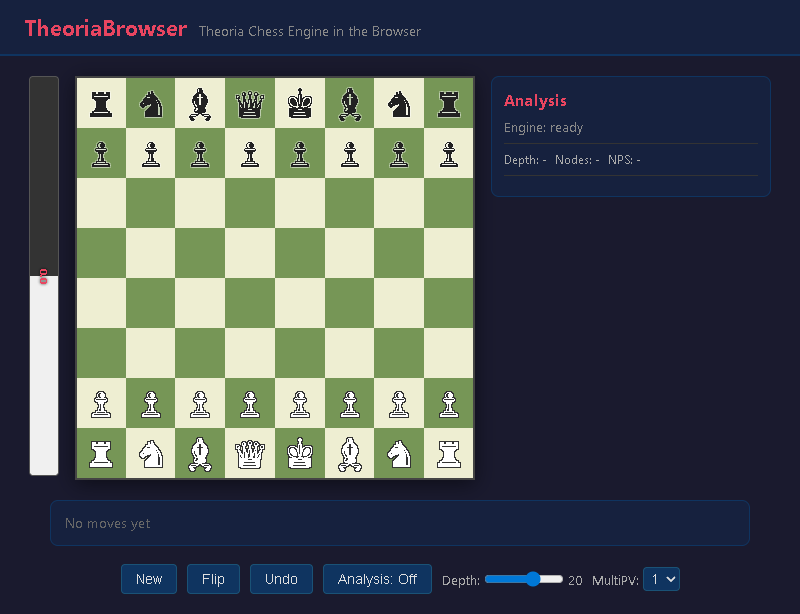

# TheoriaBrowser

A browser-based chess analysis UI powered by the [Theoria](https://www.theoriachess.org/) chess engine compiled to WebAssembly. Theoria is a fork of Stockfish 17.1 with a custom NNUE trained on Leela Chess Zero data, tuned for pedagogical clarity rather than raw Elo.

The engine runs entirely in your browser — no server, no installation beyond Node.js for the dev server.



---

## Quick Start

### 1. Clone the repo

```bash
git clone https://github.com/amathur2k/TheoriaBrowser.git
cd TheoriaBrowser
```

### 2. Run the install script

The install script checks for Node.js, installs dependencies, and downloads the required NNUE neural network file (~3.4 MB).

**Windows (PowerShell):**
```powershell
.\install.ps1
```

**Mac / Linux:**
```bash
chmod +x install.sh
./install.sh
```

### 3. Start the dev server

```bash
npm run dev
```

Then open **http://localhost:5173** in your browser.

---

## Requirements

- **Node.js** 18 or newer — [nodejs.org](https://nodejs.org)
- A modern browser (Chrome, Firefox, Safari, Edge)
- No server required — everything runs client-side

---

## What the install script does

1. Verifies Node.js is installed
2. Runs `npm install`
3. Downloads `nn-baff1ede1f90.nnue` (~3.4 MB) — the Theoria small NNUE model — into `public/wasm/`

The NNUE file is not committed to the repo (too large for git). It is hosted as a release asset and downloaded automatically by the install script. On subsequent runs the script skips the download if the file already exists.

---

## Project Structure

```
TheoriaBrowser/
├── index.html                    # App entry point
├── src/
│   ├── main.js                   # UI orchestration
│   ├── engine/
│   │   ├── theoria-worker.js     # Web Worker: loads WASM + NNUE
│   │   └── uci.js                # Promise-based UCI protocol wrapper
│   └── ui/
│       ├── board.js              # Chessboard (click-to-move, highlights)
│       ├── analysis.js           # PV lines, depth, nodes display
│       └── evalbar.js            # Evaluation bar (Lichess-style)
├── public/wasm/
│   ├── theoria.js                # Emscripten JS loader (committed)
│   ├── theoria.wasm              # Compiled engine binary (committed)
│   └── nn-baff1ede1f90.nnue     # NNUE model (downloaded by install script)
├── build/
│   ├── build.js                  # WASM build script (requires Emscripten)
│   └── embed-nnue.js             # Converts NNUE binary to C header
└── theoria-src/                  # Theoria C++ engine source
```

---

## Rebuilding the WASM from Source

Only needed if you modify the C++ engine. Requires [Emscripten SDK](https://emscripten.org/docs/getting_started/downloads.html) 3.1.51.

```bash
# Install emsdk (example path — adjust as needed)
git clone https://github.com/emscripten-core/emsdk.git ~/emsdk
cd ~/emsdk
./emsdk install 3.1.51
./emsdk activate 3.1.51
source ./emsdk_env.sh   # Linux/Mac
# or on Windows: emsdk_env.bat

cd /path/to/TheoriaBrowser
npm run build:wasm
```

The WASM build script (`build/build.js`) expects emsdk at `~/emsdk` on Linux/Mac or `C:\Users\<username>\emsdk` on Windows. Edit the path at the top of `build/build.js` if yours differs.

---

## Production Build

```bash
npm run build
```

Outputs a static site to `dist/`. Can be served by any web server. No Node.js required at runtime.

---

## License

TheoriaBrowser UI code is MIT licensed.
The Theoria engine (`theoria-src/`) is licensed under GPL v3 — see `theoria-src/Copying.txt`.
